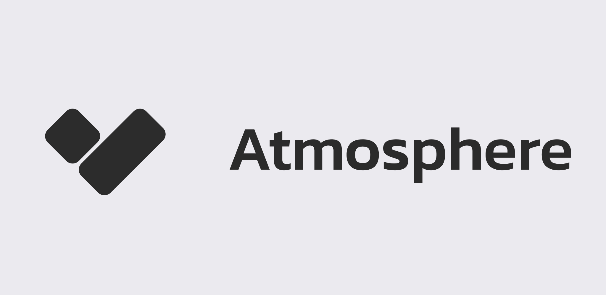
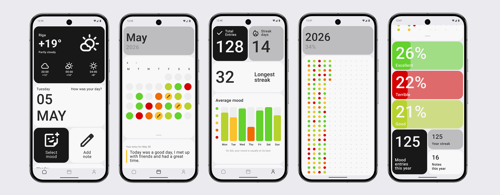

# Atmosphere App

This document describes how the app was designed and built.

The app is still a work in progress, so some things may change!

**Atmosphere** is an app designed for short but daily use, so we put a lot of care into building it.
The app is built entirely with Kotlin and Jetpack Compose,
following the official Android architecture guidelines and best practices.

## ✨ Features

Atmosphere was built to help users track and understand their mood over time.

* Quickly log your mood for the day and add personal notes or thoughts.
* Statistics show your average mood for each day of the week, with yearly stats available in a clear and intuitive interface.
* A calendar grid gives you a visual overview of your mood history month by month.
* Set a convenient daily reminder time to never miss logging your mood.
* Flexible appearance settings — customize the app theme, choose a mood color palette, and personalize each individual mood.
* Supports English, Russian, and Japanese languages.
* The app works almost fully offline — all data is stored locally on your device and never shared.
* A built-in weather widget shows the upcoming forecast so you can track how weather affects your mood.

## Screenshots

## 🛠 Tech Stack

The project is written in 100% Kotlin using the modern, Google-recommended stack:

* **UI:** [Jetpack Compose](https://developer.android.com/jetpack/compose) — fully declarative UI.
* **Architecture:** UDF (Unidirectional Data Flow) with an **MVI** approach.
* **DI:** [Hilt](https://dagger.dev/hilt/) for dependency injection.
* **Async:** [Coroutines](https://kotlinlang.org/docs/coroutines-overview.html) and [Flow](https://kotlinlang.org/docs/flow.html).
* **Data storage:** [Room](https://developer.android.com/training/data-storage/room) (SQLite) and [DataStore Preferences](https://developer.android.com/topic/libraries/architecture/datastore).
* **Analytics & stability:** [Firebase Crashlytics & Analytics](https://firebase.google.com/docs/crashlytics).

## 🏗 Architecture

**Atmosphere** follows the [official Android architecture guidelines](https://developer.android.com/topic/architecture) and is fully modularized.

### :build-logic

The project uses a build system based on **Gradle Convention Plugins** (the `build-logic` module).
This allows reusing Gradle configurations across modules and keeps `build.gradle.kts` files clean and concise.

### :core

A set of shared library modules used by feature modules. They contain no screen-specific UI logic:

- **:core:common** — shared utilities and extensions used throughout the project
- **:core:data** — repository implementations combining data sources (database, network, DataStore)
- **:core:database** — local Room database: entities, DAOs and migrations
- **:core:designsystem** — app design system: theme, colors, typography and base UI components
- **:core:model** — domain data models shared between layers
- **:core:navigation** — navigation routes
- **:core:network** — network layer: Retrofit API interfaces and DTO models
- **:core:notifications** — notification logic: alarm scheduler and notification display
- **:core:presentation** — base classes for the MVI architecture: `BaseViewModel`, `UiState`, `UiEvent`, `UiEffect`

### :feature

Feature modules handle specific screens and user flows. Each feature is split into two submodules:

- **:api** — the public contract of the feature: navigation routes and interfaces accessible to other modules
- **:impl** — the implementation: screens, ViewModels and business logic hidden from other modules

Feature list:

- **:feature:home** — main screen with mood selection and weather display
- **:feature:calendar** — calendar with mood visualization per day
- **:feature:profile** — statistics: streaks, average mood charts and counters
- **:feature:yearlystats** — yearly statistics as a day matrix
- **:feature:settings** — app settings with navigation to subsections
- **:feature:onboarding** — first launch screen with permission requests

### :app

The root application module. Contains `MainActivity`, the `Application` class, the navigation entry point (`AppNavHost`) and top-level DI modules.

## 🚀 Getting Started

### Prerequisites
* [Android Studio](https://developer.android.com/studio) (Ladybug or newer recommended)
* JDK 17

## Build

### Firebase Setup (Required)
To compile the project successfully, you need to add the Firebase configuration file:
1. Create a project in the [Firebase Console](https://console.firebase.google.com/).
2. Download the `google-services.json` file.
3. Place it in the `app/` directory of the project.

**OR**

You can remove the `firebase` plugin from the `:app` module.

After adding `google-services.json` or removing the plugin,
simply open the project in Android Studio and press **Run** (`Shift + F10`).

## ⚠️ Important
Since the `release` build requires a `.keystore` file,
it is recommended to run the project in `debug` mode only.
